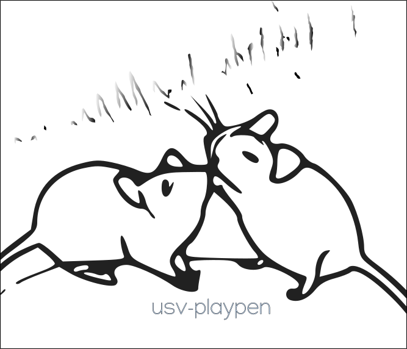

# usv-playpen v0.3.9

<br>
<div align="center">
  
</div>
<hr>

GUI to facilitate conducting experiments with e-phys (Neuropixels), multichannel audio (Avisoft) and multi-camera video (Loopbio) acquisition. Developed for behavioral recording purposes at the [Princeton Neuroscience Institute](https://pni.princeton.edu/) 2021-24 (Falkner/Murthy labs). Due to proprietary software design and limitations, recordings can only be performed on OS Windows. The data processing branch of the GUI is platform-independent.

[](https://img.shields.io/badge/Python-3.10-blue)
[](https://zenodo.org/badge/latestdoi/566588932)
[](https://github.com/bartulem/usv-playpen/)
[](https://www.repostatus.org/#active)

[](https://github.com/bartulem/usv-playpen/blob/main/LICENSE)
[](https://github.com/bartulem/usv-playpen/)
[](https://github.com/bartulem/usv-playpen/)
[](https://img.shields.io/badge/all_contributors-1-orange.svg?style=flat-square)


## Prerequisites

* [Helvetica](https://freefontsfamily.net/helvetica-font-family/) (download and install)
* [Python 3.10](https://www.python.org/downloads/) (and add it to top of PATH)
* [git](https://git-scm.com/download/)  (and add it to PATH)
* [ffmpeg](https://ffmpeg.org/download.html) (and add it to PATH)
* [sox](https://sourceforge.net/projects/sox/)  (and add it to PATH)
* [sleap](https://sleap.ai/) 
* [das](https://janclemenslab.org/das/)

## Installation and updating

Set up a new virtual environment with Python 3.10 and give it any name, _e.g._, usv.
```bash
python -m venv usv
```
Activate the virtual environment with:
```bash
source ./usv/bin/activate
```
or, on OS Windows:
```bash
.\usv\Scripts\activate
```
Install GUI with command below. Also, rerun the same command to check for and install updates.
```bash
pip install git+https://github.com/bartulem/usv-playpen --use-pep517
```

Add the python-motifapi package to your virtual environment:
```bash
pip install git+https://github.com/loopbio/python-motifapi.git#egg=motifapi --use-pep517
```

## Test installation
Navigate to the main repo directory (example below).
```bash
cd /.../usv/lib/site-packages/usv-playpen
python -m unittest -v _tests.recording_tests
python -m unittest -v _tests.processing_tests
```

## Example features

* behavioral_experiments.ExperimentController --> run behavioral experiments with Loopbio/Avisoft software
* extract_phidget_data.Gatherer --> extract data measured by illumination and temperature/humidity phidgets
* file_manipulation.Operator --> (1) break from multi to single channel, band-pass filter and temporally concatenate Avisoft-generated audio (_e.g._, WAV) files,
                                 (2) concatenate Motif-generated video (_e.g._, mp4) files and re-encode them to correct sampling rate (fps)
* synchronize_files.Synchronizer --> cut WAV file to video file (_e.g._, mp4) length and perform A/V synchronization check
* preprocessing_plots.SummaryPlotter --> generate summary figure for data preprocessing (_i.e._, metadata and sync quality)

## Usage

Locate the pip installed package:
```bash
pip show usv-playpen
```
Navigate to the directory w/ the "usv_playpen_gui.py" file (example path listed below).
```bash
cd /.../usv/lib/site-packages/usv-playpen
```

Run the GUI.
```bash
python usv_playpen_gui.py
```

Developed and tested in PyCharm Pro 2024.1.1, on macOS Sonoma 14.4 / Ubuntu 22.04 LTS/ Windows 10.
