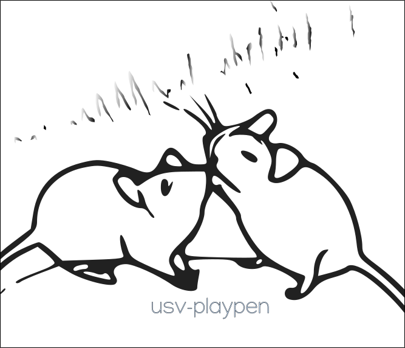

# usv-playpen v0.1.0

GUI to facilitate conducting experiments with multichannel audio (Avisoft) and multi-camera video (Loopbio) acquisition. Developed for behavioral recording purposes at the [Princeton Neuroscience Institute](https://pni.princeton.edu/) 2021-23 (Falkner/Murthy labs). Due to proprietary software design and limitations, recordings can only be performed on OS Windows. The data processing branch of the GUI is platform-independent.

<p align="center">
  
</p>

## Prerequisites

* [Python 3.10](https://www.python.org/downloads/) (and add it to PATH)
* [pip](https://pip.pypa.io/en/stable/) (and add it to PATH)
* [git](https://git-scm.com/download/)  (and add it to PATH)

## Installation and updating

Set up a new virtual environment with Python 3.10 and give it any name, _e.g._, venv_name.
```bash
python3.10 -m venv venv_name
```
Activate the virtual environment with:
```bash
source ./venv_name/bin/activate
```
or, on Windows:
```bash
.\venv_name\Scripts\activate
```
Install GUI with command below. Also, rerun the same command to check for and install updates.
```bash
pip install git+https://github.com/bartulem/usv-playpen
```

## Features

* behavioral_experiments.ExperimentController --> run behavioral experiments with Loopbio/Avisoft software
* extract_phidget_data.Gatherer --> extract data measured by illumination and temperature/humidity phidgets
* file_manipulation.Operator --> (1) break from multi to single channel, band-pass filter and temporally concatenate Avisoft-generated audio (_e.g._, WAV) files,
                                 (2) concatenate Motif-generated video (_e.g._, mp4) files and rectify their frame rates (fps)
* synchronize_files.Synchronizer --> cut WAV file to video file (_e.g._, mp4) length and perform a/v synchronization check
* preprocessing_plots.SummaryPlotter --> generate summary figure for data preprocessing (_i.e._, metadata and sync quality)

## Usage

Navigate to the directory w/ the "usv_playpen_gui.py" file (w/ the venv activated!).
```bash
cd /.../usv-playpen/src
```

Run the GUI.
```bash
python3.10 usv_playpen_gui.py
```

Developed and tested in PyCharm Pro 2022.3.2, on Windows 10/Ubuntu 22.04 LTS.
